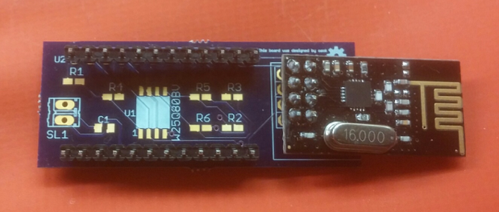
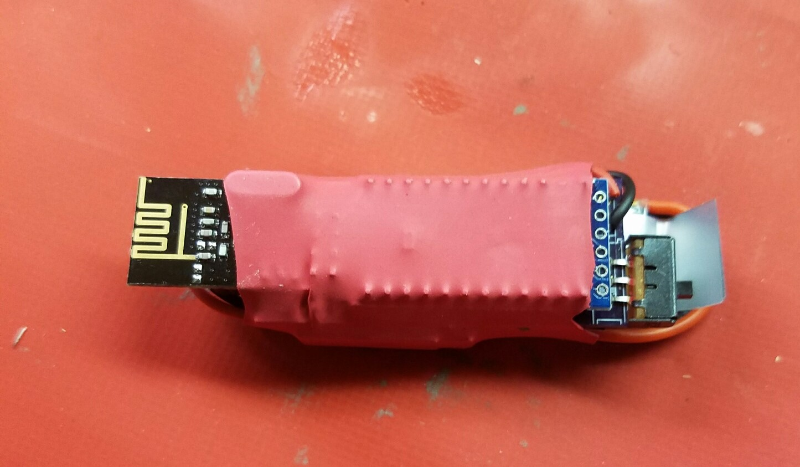

Keysweeper Modifications

Originally, Samy.PL created and documented the keysweeper ( [https://samy.pl/keysweeper/)](https://samy.pl/keysweeper/)) as a tool to man in the middle vulnerable Microsoft wireless keyboards.

His original design used a Arduino Mini, GSM module, 2.4 GHz System on a Chip (SoC) and USB Charger to lock onto a channel used by a Vulnerable MS wireless keyboard, capture the keystrokes and post them to a web site where the attacker could use the information.

After reviewing the design, it was determined that using the device could inject risk that a third party could ease drop on the data stream or gain access to the web application.  So modifications were designed to capture the keystrokes and log them to an on board memory chip that could be reviewed at a later time.  Additionally, a battery was added so that the device could be carried in a pocket, backpack or left taped under a desk, without need of plugging into a 120 volt wall socket.

Samy.Pl page mentions that the W25Q80BV flash chip can be used, but didn&#39;t contain code to use it.  To make these changes a library had to be developed to interface with the chip.  This library provides methods to read, write and clear the contents of the chip from an Arduino project.  It provides both a programmatic API and a user prompt that allows the same capabilities.

https://github.com/osok/WinBod-25Q80BV

The W25Q80BV chip

A daughter board was designed in Eagle CAD, and fabricated by OSH Park, which connected the W25Q80BV chip to the Arduino mini and NRF24L01.  Surface mount components were used to make the board lower smaller.

The eagle cad designs, including the .brd file which is used when uploading to OSHPark for board fabrication, can be found in the eagle directory.

The board is 2 inches in length.

The NRF24L01 board extends off the end of the board to provide less interference with the antenna.  The Arduino Mini is coupled to the daughter board with riser pins.

All the boards attached

The battery that I choose was a 3.7 volt LiPo for small drones.

Finally, some shrink wrap allows a neat little package.

The most recent rev of the board has an on off power switch and a switch for keyboard hijacking and reading the memory.  Switch it to memory read then connect to the Arduinos serial interface with a FTDI connector and interact with the memory app.

To have the board fabricated, upload the design to OSH Park.  You will need to order 3 boards minimum, which will cost around $10 and take 2 to 3 weeks to arrive.   [https://oshpark.com/](https://oshpark.com/)  The board is Open source Hardware.

To have a stencil created for spreading solder paste you can upload the .brd file to OSH Stencil.  https://www.oshstencils.com/

The updated code for the Arduino can be downloaded from my GitHub.
